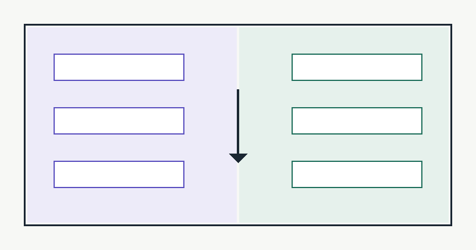

泛型通配符每次用都要想半天，干脆把结论固化下来：**PECS**——Producer Extends, Consumer Super。这张记忆卡贴在工位上：



## 两个方向的约束

`List<? extends Number>` 的引用**不能写入**（编译器不知道确切类型），只能当生产者读；`List<? super Integer>` 的引用**读出来只能是 Object**，适合当消费者写。

```java title="GenericsDemo.java"
import java.util.ArrayList;
import java.util.List;

public class GenericsDemo {

    // Producer：只从 src 读，用 extends
    static double sum(List<? extends Number> src) {
        double total = 0;
        for (Number n : src) total += n.doubleValue();
        return total;
    }

    // Consumer：只往 dst 写，用 super
    static void fill(List<? super Integer> dst, int count) {
        for (int i = 0; i < count; i++) dst.add(i);
    }

    public static void main(String[] args) {
        List<Integer> ints = new ArrayList<>();
        fill(ints, 5);                       // Integer 写入 List<Integer>
        System.out.println(sum(ints));       // 10.0
    }
}
```

## 为什么编译器要这么严

`List<? extends Number>` 可能是 `List<Integer>` 也可能是 `List<Double>`。若允许 `add(1.0)`，往 `List<Integer>` 里塞 Double 就破坏了类型安全——所以干脆禁止写入。编译器不是保守，是在替你守住运行时的类型承诺。

### 擦除的边界

泛型信息在运行时被擦除，`new T[]` 与 `instanceof List<String>` 都不合法。需要运行时类型时，用 `Class<T>` 参数把类型信息显式传进来。
